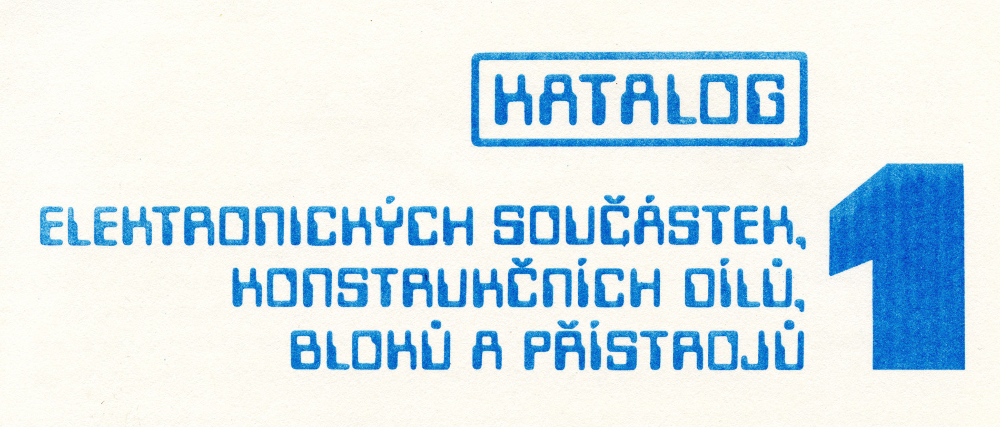
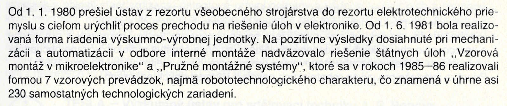
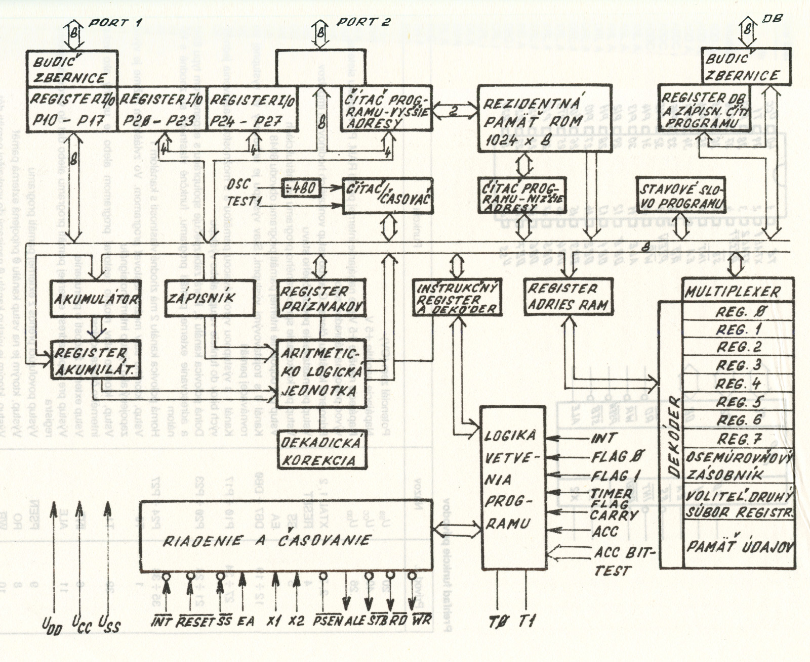

# Tesla Fonts

Directory of fonts used by Czechoslovak company Tesla.

## Data 70

Proprietary font, available at various font distributors.

## Helvetica

Proprietary font, available at various font distributors (also ships with Mac OS).

## Eltos Schema Cursiva

Fan-made font based on Tesla Eltos catalog documentation handwriting. IN PROGRESS!

Download: <a href="./eltos-schema-cursiva/font/EltosSchemaCursiva-Regular.otf">EltosSchemaCursiva-Regular.otf</a>  
Licensed under the [SIL Open Font License 1.1](./eltos-schema-cursiva/font/OFL.txt).

